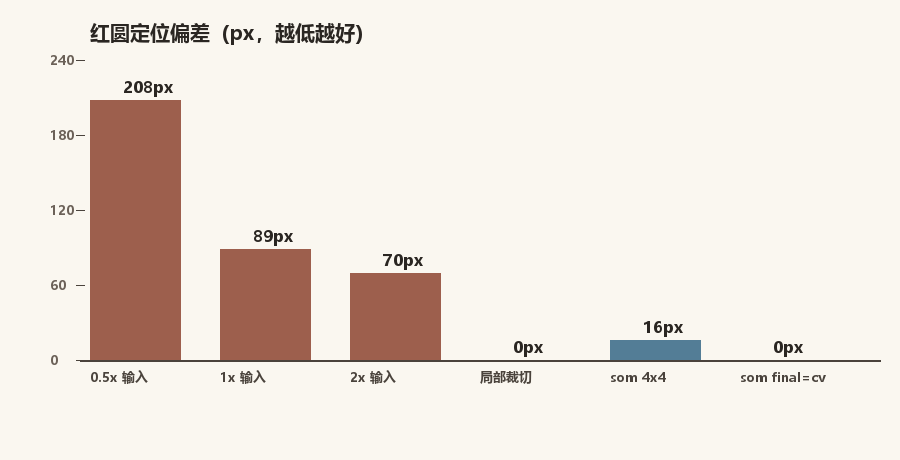
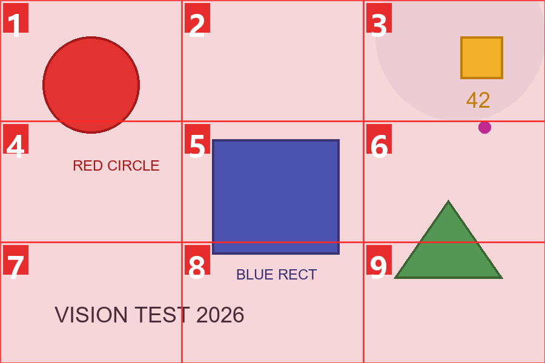
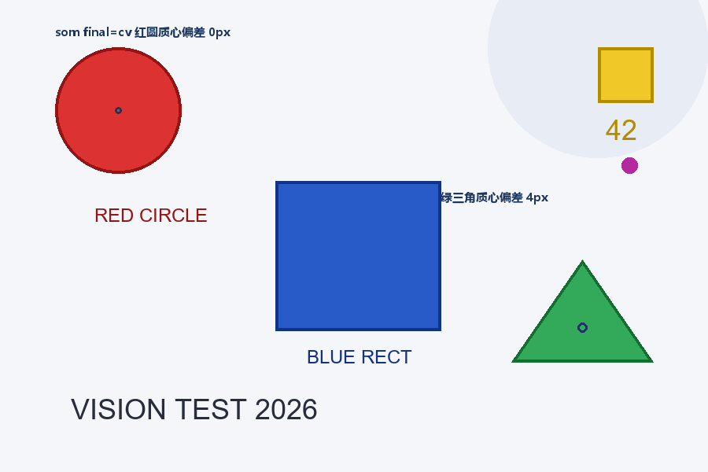

# Vision Primitives MCP — a vision-primitive MCP server that gives text-only LLMs eyes

[简体中文](./README.md) | [English](./README.en.md)

Give text-only LLMs (DeepSeek / Codex / any MCP client) full vision through 27 MCP tools: **describe → locate (coordinates) → OCR → annotate → crop/zoom → anomaly scan → computer use**. Swappable vision backends (cloud Xiaomi MiMo V2.5 / local Qwen3-VL via LM Studio), single-file Python; core Pillow-only, numpy optional (285x template-match speedup), YOLO detector optional (auto-enabled when `models/icon_detect.pt` present).

```
text-only LLM (reasoning & decisions)
    │  MCP protocol (stdio, JSON-RPC 2.0)
    ▼
vision_primitives_mcp.py (single file, 24 tools, zero third-party runtime deps)
    │  OpenAI-compatible API
    ▼
MiMo V2.5 (cloud) / Qwen3-VL-8B (local LM Studio) / any vision VLM
```

## Measured benchmark (2026-08-02, programmatic ground truth)

Test image (900×600, element positions known): red circle center (150,140), green triangle center (740,417):


### Whole-image locate comparison (MiMo V2.5 vs local Qwen3-VL-8B)


**Full comparison incl. Qwen2.5-VL-7B (measured 2026-08-02):**


### Model comparison matrix (same benchmark image, programmatic ground truth)

| Model | locate red | locate tri | som red | som tri | per call | ui_parse full | ui_refine full |
|---|---|---|---|---|---|---|---|
| MiMo V2.5 (cloud) | 64px | 97px | — | — | 15-25s | — | — |
| Qwen3-VL-8B (local) | 90px | 164px | 77px | 123px | 10-30s | 29.4s | >357s (timeout) |
| **Qwen2.5-VL-7B (local)** | **28px** | **27px** | **15px** | 123px | **1.3-1.7s** | **12.4s** | **12.6s** |

Takeaways: Qwen2.5-VL-7B grounding specialist (RefCOCO 93.7%) + non-thinking architecture gives 3-6x accuracy and 10-20x speed over Qwen3-VL-8B; both models lock into the wrong cell on green-triangle som (123px) — use `final="cv"` or crop-based locate instead.

| Method | Red circle | Green triangle | Notes |
|---|---|---|---|
| `locate_object` (coordinate output) | MiMo 64px / Qwen 89px | MiMo 97px / Qwen 164px | generic VLM direct coordinates, limited by vision-token granularity |
| `som_locate` (number reference, 3×3×2) | Qwen **34px** | Qwen 123px | turns coordinates into a numbering problem |
| `som_locate` 4×4 grid | Qwen **16px** | 206px (locked into wrong cell) | finer grid helps but depends on round-1 correctness |
| `cursor_locate` (interactive search) | Qwen 100px (5 steps, 80s) | — | local small model estimates offsets poorly; keep for strong cloud models |
| `som_locate final="cv"` | Qwen **0px** (<1s) | Qwen **4px** (<1s) | VLM convergence + CV precision, pixel-level, pure-local |

### Ablation: the root cause is "resolution dilution"



- Input 0.5x / 1x / 2x → 208 / 89 / 70px error: accuracy improves monotonically with resolution
- Isolated crop of the target: red circle **0px**, green triangle **3px**: the model's grounding ability is fully intact
- Conclusion: whole-image locate error = global resolution dilution (too few vision tokens per object). **The fix is "coarse locate → crop → precise locate"**, which is exactly what `som_locate` recursion and `final="cv"` do

### SoM numbered marks example



Each round overlays numbered marks; the model answers a number, then the region is cropped and 2x zoomed for the next round.

### CV fallback: pixel-level locate for simple targets



`cv_locate` (color segmentation + connected-component centroid): pure-local, zero API calls, measured 0-4px. **Only for simple targets** (solid-color UI click elements, geometric shapes, fixed templates); limited generalization — use VLM locate for general targets.

## Tool overview (27 tools)

| Category | Tools | Purpose |
|---|---|---|
| Basic vision | `describe_image` / `analyze_image` | description / structured analysis with coordinate primitives |
| Locate | `locate_object` | coordinate-output locate, `refine` two-stage refinement |
| | `som_locate` | **SoM numbered-grid recursive locate** (`final`: box/number/cv) |
| | `cursor_locate` | cursor-move + visual-feedback loop locate (GUI-Cursor paradigm) |
| | `cv_locate` | **CV fallback**: color segmentation / template matching, pixel-level, simple targets only |
| `ui_parse` / `ui_locate` / `ui_refine` | **UI structured parsing / text-anchored locate / detection-box semantic editing**: YOLO pixel-level detection + text anchoring + VLM review (remove false positives / semantic labels / programmatic merge) |
| Text | `ocr_image` | per-block OCR with bbox |
| Image ops | `annotate_image` / `crop_image` / `zoom_region` | annotate / crop / zoom |
| Advanced | `compare_images` / `compare_infer` / `reason_graph` / `annotate_infer` | multi-image compare / joint reasoning / interactive graph reasoning / virtual-annotation reasoning |
| Scan | `scan_anomalies` | automated anomaly scan: tiled candidates → high-res verification (PCB components) |
| Computer use | `screen_capture` / `screen_info` / `screen_click` / `screen_move` / `screen_drag` / `screen_scroll` / `screen_type` / `screen_key` | screenshot + mouse/keyboard (safety switch default off) |
| Diagnostics | `vision_health` | backend config & connectivity |

Coordinates: `pixel` (default, most accurate in practice) or `norm` (0-1000 normalized), out-of-bounds clamped.

## Locate methodology: four modes & VLM selection

| Mode | Principle | When to use |
|---|---|---|
| `locate_object` | model outputs coordinates directly | general fallback; fast coarse locate |
| `som_locate` | number reference + recursive crop, fights dilution | **recommended general** (`final="box"` outputs a box on the converged local image) |
| `cursor_locate` | relative offset + visual-feedback convergence | interactive convergence (suggest strong cloud models) |
| `cv_locate` | color segmentation / template matching, pure-local | fallback for simple targets: solid-color UI, geometry, fixed templates |
| `ui_parse` / `ui_locate` | **structured parsing + text anchoring** (OCR text → control box); optional YOLO detector (OmniParser icon_detect) | **first choice for UI clicks**: pixel-level detection boxes (red circle 4px measured), VLM only does numbered semantic selection |

**VLM selection advice**: prefer grounding-trained models for locate tasks (evidence: GUI-Actor / SE-GUI / GUI-Cursor papers identify weak spatial-semantic alignment in text-coordinate generation):

- **First choice Qwen-2.5-VL-7B** (local LM Studio): dedicated grounding training (RefCOCO 93.7%), measured whole-image locate 27-28px / som 15px, 1.3-1.7s per call (non-thinking, 10-20x faster)
- **Alternative Qwen-3-VL-8B**: measured 90-164px whole-image locate, 10-20x slower (thinking model, grounding not inherited); consider only for describe/OCR
- Avoid: Qwen-3.5-9b (no grounding training, measured 210px), Gemma4-E4B (no grounding track record)
- Cloud MiMo V2.5: excellent describe/OCR, pair with `som_locate` for locate; `ui_refine` review suggests strong cloud models
- **Division of labor (measured)**: use Qwen2.5-VL-7B for locate/review; **OCR recall differs by model** (Qwen2.5-VL 1.2s but returns 1 block, Qwen3-VL/MiMo return all) — for text anchoring prefer Qwen3-VL/MiMo OCR; `cursor_locate` unusable on both local models (483/100px), cloud-only
- **Measured benchmark (2026-08-02, Qwen2.5-VL-7B vs Qwen3-VL-8B)**: locate red circle 28 vs 90px, green triangle 27 vs 164px; som red circle 15 vs 77px; per-call 1.5 vs 20s; ui_parse 12.4 vs 29.4s; single-question review 0.6 vs 4.2s

## Quick start

**UI detector (optional)**: download [OmniParser icon_detect](https://huggingface.co/microsoft/OmniParser-v2.0/resolve/main/icon_detect/model.pt) (39.7MB, MIT) into `models/icon_detect.pt`; `ui_parse` auto-enables pixel-level YOLO element detection (requires `pip install ultralytics`).

```toml
# ~/.codex/config.toml
[mcp_servers.vision-primitives]
command = "python"
args = ['/path/to/vision-primitives-mcp/vision_primitives_mcp.py']
startup_timeout_sec = 60

[mcp_servers.vision-primitives.env]
VISION_API_BASE = "https://api.xiaomimimo.com/v1"      # or local http://127.0.0.1:1234/v1
VISION_API_KEY = "your-mimo-key"                        # any placeholder for local LM Studio
VISION_MODEL = "mimo-v2.5"                              # or qwen/qwen3-vl-8b
VISION_OUTPUT_DIR = '/path/to/vision-primitives-mcp/generated'
```

Key env vars: `VISION_TIMEOUT_S`(120) / `VISION_MAX_IMAGE_MB`(20) / `VISION_SAMPLES`(1, locate stability) / `VISION_DISABLE_THINKING`(1 for local thinking models) / `VISION_NO_SYSTEM`(1 for small local models).

## Known limits (honest)

- **Whole-image locate suffers resolution dilution**: complex/small targets 20-164px error; fight it with `som_locate` recursion or `final="cv"`
- **Latency**: MiMo reasoning model 15-25s per call; local Qwen3-VL 3-10s; `cv_locate` pure-local milliseconds
- **`scan_anomalies` angle estimates unstable** (10°-35°), value is multi-candidate + per-candidate verification; physical check still required
- **`cursor_locate` underperforms on local small models**; keep for strong cloud models
- **`ui_refine` VLM review: suggest strong cloud models** (local 8B thinking models can take minutes on long JSON output); programmatic merge/dedup has no such limit
- **`cv_locate` limited generalization**: only simple targets with clear color/template features; template matching degrades on solid (texture-free) targets (ZNCC property)
- **Platform**: the 8 screen-control tools are Windows-only (ctypes + ImageGrab); on macOS/Linux only capture/info work
- **SSRF guard**: URL images block private/link-local/metadata addresses by default (loopback allowed), `VISION_ALLOW_PRIVATE_NET=1` to allow; URL images limited to 50MP decompressed (local files support 200MP PCB)

## Changelog (condensed)

- **v1.10 (2026-08-02)**: SoM numbered locate (`som_locate`, final=box/number/cv), Cursor interactive search, CV fallback (`cv_locate`); 24 tools; 142 tests; locate methodology + grounding VLM selection sections; MCP protocol fix (jsonrpc/id in response frames, strict-client compatibility)
- **v1.9 (2026-08-02)**: Computer Use (8 screen-control tools, safety switch default off)
- **v1.8.x**: compare_infer / reason_graph / annotate_infer (virtual annotation + graphical reasoning) / coordinate-format experiments (pixel most stable) / extract_json hardening
- **v1.7**: locate_object `refine` two-stage refinement (70→20px)
- **v1.1-1.6**: scan_anomalies (PCB practice), compare_images, Chinese OCR fix (GDI+ rendering)

## Tests & security

```bash
python test\run_tests.py   # 142 mock tests, no real key needed
python test\e2e_mimo.py    # real end-to-end (requires VISION_API_KEY)
```

- Input images read-only; uploads go only to the configured backend; `out_path` forced inside the output dir; URL images have SSRF & decompression-bomb protection
- API key lives in local config only; screen-control tools refuse by default (`VISION_ALLOW_SCREEN_CONTROL=1` to enable)

**Repo**: [github.com/zouyuanqing/vision-primitives-mcp](https://github.com/zouyuanqing/vision-primitives-mcp)
