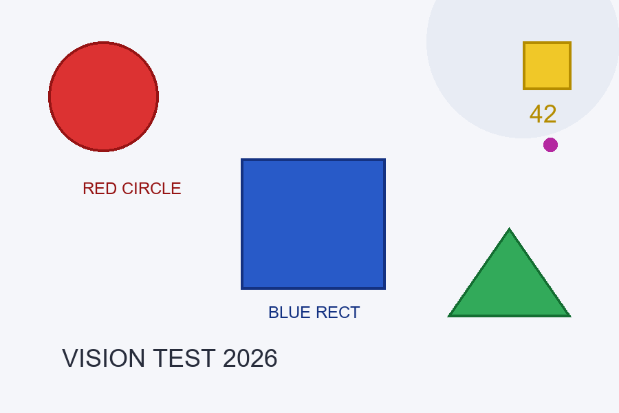
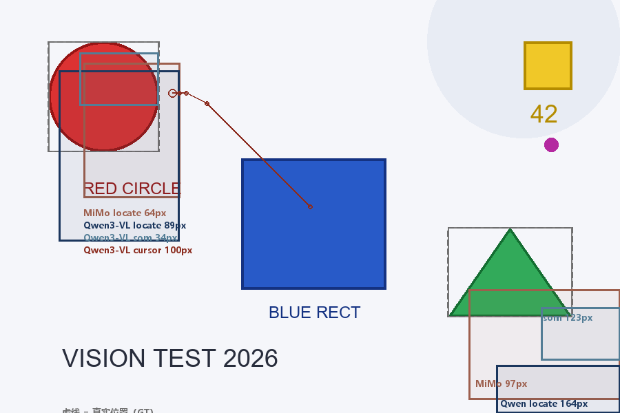
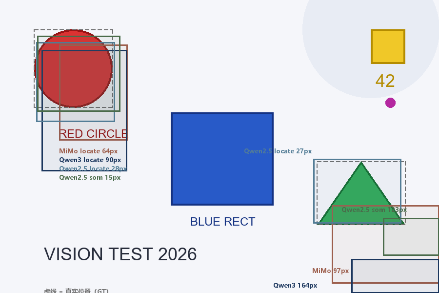

# Vision Primitives MCP — a vision-primitive MCP server that gives text-only LLMs eyes

[简体中文](./README.md) | [English](./README.en.md)

Give text-only LLMs (DeepSeek / Codex / any MCP client) full vision through **30 MCP tools**: **describe → locate (coordinates) → OCR → annotate → crop/zoom → anomaly scan → UI structuring → multi-round reasoning → computer use**. Swappable vision backends (cloud MiMo V2.5 / local Qwen2.5-VL via LM Studio), single-file Python, Pillow-only core.

> **Positioning**: a general vision-reasoning bridge — text models + **any VLM** in a general vision workflow, local privacy, single-file lightweight. **High generalization first**: core capabilities (locate/tile/zoom/read) are pure VLM + PIL; dedicated detectors (YOLO/CRAFT) are pluggable accelerators — faster when present, full function without. **Not** competing with end-to-end GUI models (UI-TARS / CogAgent, which have dedicated training); differentiation is **fallback locate without grounding models** and **multi-round visual reasoning with any model**.

```
text-only LLM (reasoning & decisions)
    │  MCP protocol (stdio, JSON-RPC 2.0)
    ▼
vision_primitives_mcp.py (single file, 30 tools, 186 tests)
    │  OpenAI-compatible API
    ▼
MiMo V2.5 (cloud) / Qwen2.5-VL-7B (local LM Studio) / any vision VLM
```

## Measured benchmark (2026-08-02, programmatic ground truth)

Test image (900×600, known element positions): red circle center (150,140), green triangle center (740,417):



### Locate comparison (3 models × multiple modes)





**Locate matrix** (same benchmark image, pixel-level verification):

| Model | locate red | locate tri | som red | som tri | per call | ui_parse | ui_refine |
|---|---|---|---|---|---|---|---|
| MiMo V2.5 (cloud) | 10-64px (variance) | 79-97px (variance) | 33-82px (variance) | 13-123px (variance) | 15-25s | 21.5s | — |
| MiMo + som-cv (fallback) | **0px** | **4px** | — | — | 10-12s | — | — |
| Qwen3-VL-8B (local) | 90px | 164px | 77px | 123px | 10-30s | 29.4s | >357s |
| **Qwen2.5-VL-7B (local)** | **28px** | **27px** | **15px** | 123px | **1.3-1.7s** | **12.4s** | **12.6s** |

**Capability matrix** (describe / OCR / fallback locate / text anchoring / multi-round reasoning):

| Model | describe | OCR (post-fix) | som-cv (color) | ui_locate anchor | scratch paper |
|---|---|---|---|---|---|
| MiMo V2.5 (cloud) | 4.7s ✓ | 8.9s, 4/4 blocks | **0px** (3.2s) | 8.6s ✓ | 45.7s 3 rounds (missed trend) |
| **Qwen2.5-VL-7B (local)** | 1.1s ✓ | 3.5-4.6s, 4/4 blocks | **0px** | 12.8s ✓ | **9.6s 1 round, correct** |
| Qwen3-VL-8B (local) | ~10s | 23s, 4/4 blocks | 0px | — | — |

**Ablation: locate error roots in "resolution dilution"** — input 0.5x→208px / 2x→70px / isolated crop→**0-3px**. Whole-image locate error is not model ability but too few vision tokens per object; **"coarse locate → crop → precise locate" pipelines are the fix** (`som_locate` recursion, `final="cv"`, `text_zoom` grid all build on this).

## Tool overview (30 tools)

| Category | Tools | Purpose |
|---|---|---|
| Basic | `describe_image` / `analyze_image` | description / structured analysis with coordinate primitives |
| Locate | `locate_object` | coordinate-output locate, `refine` two-stage |
| | `som_locate` | SoM numbered-grid recursive locate (`final`: box/number/cv) |
| | `cursor_locate` | cursor-move + visual-feedback loop (GUI-Cursor paradigm, cloud models suggested) |
| | `cv_locate` | CV fallback: color segmentation / template matching, pixel-level (numpy 285x) |
| Text | `ocr_image` | per-block OCR with bbox |
| | `text_detect` | CRAFT text-region detection (local onnx, optional accelerator) |
| | `text_zoom` | **programmatic tile-and-zoom (high-generalization default)**: grid tiles + VLM precision reading |
| UI | `ui_parse` / `ui_locate` / `ui_refine` | YOLO detection + text anchoring + VLM semantic editing of detection boxes |
| Image ops | `annotate_image` / `crop_image` / `zoom_region` | annotate / crop / zoom |
| Reasoning | `scratch_think` | **vision scratchpad**: cross-round layer stack + adaptive crop-and-zoom (paper understanding) |
| | `compare_images` / `compare_infer` / `reason_graph` / `annotate_infer` | multi-image compare / joint reasoning / graph protocol / virtual annotations |
| Scan | `scan_anomalies` | automated anomaly scan: tiled candidates → high-res verification (PCB) |
| Computer use | `screen_capture` / `screen_info` / `screen_click` / `screen_move` / `screen_drag` / `screen_scroll` / `screen_type` / `screen_key` | screenshot + mouse/keyboard (Windows-only, safety switch default off) |
| Diagnostics | `vision_health` | backend config & connectivity |

Companion script [paper_reader.py](paper_reader.py): arXiv/URL/PDF/image → multi-screen capture → per-screen scratch_think → structured summary.

## Core methodology

1. **Fight resolution dilution**: the basis of all locate precision. `som_locate` (model picks numbers), `final="cv"` (VLM convergence + CV pixel-level), `text_zoom` (grid tiles) share the "local zoom" principle — differing only in how tiles are generated (model decision / detector / grid)
2. **Text anchoring**: UI instructions almost always carry text — OCR locates text → control box. An order of magnitude more reliable than asking the model to guess coordinates
3. **Pluggable detectors**: YOLO (icon_detect) / CRAFT (text) are "faster when present, full function without" — the high-generalization path (pure VLM) always works
4. **Vision scratchpad** (scratch_think): non-grounding models lack "visual working memory" — the layer stack re-renders intermediate state into the image, editable every round; the coordinate chain maps everything back to the original image
5. **Deterministic geometry in code**: overlap merging, coordinate mapping, convergence detection are programmatic; VLM handles semantics only (measured: VLM merging wrongly fuses adjacent elements)

## Quick start

```toml
# ~/.codex/config.toml
[mcp_servers.vision-primitives]
command = "python"
args = ['/path/to/vision-primitives-mcp/vision_primitives_mcp.py']
startup_timeout_sec = 60

[mcp_servers.vision-primitives.env]
VISION_API_BASE = "https://api.xiaomimimo.com/v1"      # or local http://127.0.0.1:1234/v1
VISION_API_KEY = "your-mimo-key"                        # any placeholder for local LM Studio
VISION_MODEL = "mimo-v2.5"                              # or qwen/qwen2.5-vl-7b
VISION_OUTPUT_DIR = '/path/to/vision-primitives-mcp/generated'
```

**Model selection**: locate/review/multi-round reasoning → **Qwen2.5-VL-7B** (grounding specialist + non-thinking, 1.3-1.7s/call); MiMo is general but high locate variance — use `VISION_SAMPLES=3`; Qwen3-VL-8B only for describe/OCR.

**Optional enhancements** (all "faster when present, full function without"):

| Enhancement | Install | Benefit |
|---|---|---|
| numpy | `pip install numpy` | template matching 285x |
| YOLO UI detector | `models/icon_detect.pt` ([download](https://huggingface.co/microsoft/OmniParser-v2.0/resolve/main/icon_detect/model.pt), 39.7MB) | pixel-level UI element detection in ui_parse |
| CRAFT text detector | `models/craft_text.onnx` ([download](https://huggingface.co/KvaytG/craft-mlt-25k-onnx/resolve/main/craft.onnx), 79MB) | detection-box acceleration for text_detect/text_zoom |
| playwright | `pip install playwright` | paper_reader screenshots |

## Known limits (honest)

- **Whole-image locate suffers resolution dilution** (20-164px) — fight with som recursion / final="cv" / text_zoom
- **Sub-10px labels**: text_zoom grid can read them (measured False Stop/Class Settings) but individual characters may still misread — model recognition limit
- **`cursor_locate` unusable on local models** (483/100px), cloud-only; **`ui_refine` VLM review suggests cloud** (minutes on local 8B)
- **OCR is prompt-length sensitive** (fixed — keep prompts short); table data: prefer DOM extraction, visual OCR as fallback (90-120s)
- **Platform**: 8 screen-control tools are Windows-only; **security**: URL images have SSRF guard (private-net block) and decompression limit (URL source 50MP)
- **Latency**: MiMo 15-25s/call, local Qwen2.5-VL 1.3-1.7s/call, multi-round reasoning multiplies per round

## Changelog (condensed)

- **v1.14 (2026-08-02)**: text_detect (CRAFT optional) + text_zoom (programmatic tiling, high-generalization default; measured reading sub-10px figure labels); 30 tools / 186 tests
- **v1.13 (2026-08-02)**: scratch_think vision scratchpad (layer stack + adaptive zoom + coordinate chain); paper_reader.py workflow; OCR prompt fix (recall 1→4 blocks); extract_json truncation recovery
- **v1.12 (2026-08-02)**: ui_refine detection-box semantic editing (VLM remove/label + programmatic geometric merge)
- **v1.11 (2026-08-02)**: ui_parse / ui_locate (UI structuring + text anchoring) + optional YOLO + SSRF/decompression guard + numpy template matching
- **v1.10 (2026-08-02)**: som_locate (SoM numbered recursion, final=box/number/cv) + cursor_locate + cv_locate
- **v1.9 (2026-08-02)**: Computer Use (8 screen tools, safety switch)
- **v1.7-1.8**: refine two-stage (70→20px), reason_graph, annotate_infer, coordinate-format experiments (pixel most stable)
- **v1.1-1.6**: scan_anomalies (PCB), compare_images, Chinese OCR fix
- **Fix log**: MCP response jsonrpc/id (strict-client compatibility), long-JSON truncation recovery

## Tests & security

```bash
python test\run_tests.py   # 186 mock tests, no real key needed
python test\e2e_mimo.py    # real end-to-end (requires VISION_API_KEY)
```

- Input images read-only; uploads go only to the configured backend; `out_path` forced inside the output dir
- URL images: SSRF guard (private/link-local/metadata blocked, loopback allowed) + 50MP decompressed limit
- API key lives in local config only; screen-control tools refuse by default (`VISION_ALLOW_SCREEN_CONTROL=1`)

**Repo**: [github.com/zouyuanqing/vision-primitives-mcp](https://github.com/zouyuanqing/vision-primitives-mcp)
